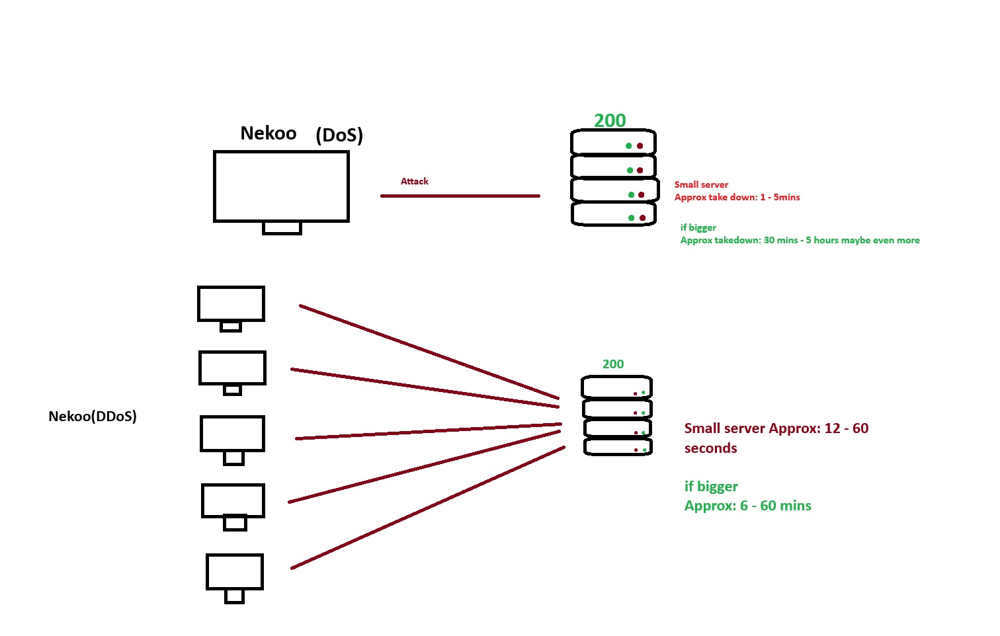

# Nekoo


## Overview
**Nekoo** is a Denial of Service (DoS) application designed to be used across multiple devices. Fully coded in C# with .NET 9, Nekoo offers a flexible and powerful solution for simulating DoS attacks. This tool is intended for educational and testing purposes, allowing users to learn about network vulnerabilities and defense mechanisms against such attacks.

**Note:** Nekoo is currently available **only for Windows**.

## Features
- **Windows Compatibility**: Developed specifically for Windows using .NET 9, ensuring a stable and optimized experience for users on Windows platforms.
- **DoS Attack Simulation**: Simulates Denial of Service attacks to stress test servers and applications.
- **C# & .NET9**: Developed in C# using the latest .NET 9 framework for optimal performance and compatibility.
- **Customizable Parameters**: Users can adjust attack parameters to simulate different types of DoS attacks.

## Installation
To get started with Nekoo, clone the repository and build the project using the following commands in your Windows Command Prompt or PowerShell:

```powershell
git clone https://github.com/Fr0zyyy/Nekoo
cd Nekoo
dotnet build
```
## Tip
**Nekoo** can be used on multiple devices to make DDoS attacks


## Available flags and commands
| Flag |  About                |
| :-------- | :------------------------- |
| `-c` | Gets Website's or Server's respond code |
| `-a` | Performs attack on Website or Server |
| `-h` | Just regular help command |

## How to use
```powershell
Nekoo https://example.com -c
```
**Output**:
If responds, 200 else other code

```powershell
Nekoo https://example.com -a
```
"-a" starts attack as i mentioned before, if the code will be still 200 the application will continue until it does not responds anymore.

Flag -a, -c does attribute itselves besides -h

example usage:

```powershell
Nekoo https://example.com -a -c
```

**Output**:
Response Code: |code| (|GOOD OR BAD|)
Attack started...

## Tutorial video
[Video](https://www.mediafire.com/file/a9wb8wfkgrx1c9k/aero.mp4/file) 

#Threads in Nekoo
There's an configuration folder named **config** with **config.yaml** 
the threads are multipled by your CPU cores if your device is  weak please put threads to 2 or 1 
> Maximum suggested threads is 16, if you put higher number than 16 it can harm your device due to overload.

# Making Nekoo Recognizable in CMD

To make Nekoo accessible from any terminal location on Windows, follow these steps:

## Steps to Configure Environment Variables

1. **Copy the Installation Path:**  
   Locate and copy the directory path where Nekoo is installed.

2. **Open System Environment Variables:**  
   Search for `Environment Variables` in the Start Menu and select **Edit the system environment variables**.

3. **Navigate to User and System Variables:**  
   In the dialog box, you'll see two sections:  
   - **User Variables**  
   - **System Variables**  

4. **Add Path in User Variables:**  
   - Find the **Path** variable under User Variables and select it.  
   - Click **Edit** and then **Add**.  
   - Paste the copied path.  
   - Save the changes and exit.

5. **Add Path in System Variables:**  
   - Find the **Path** variable under System Variables and select it.  
   - Click **Edit**, then **Add**, and paste the same path.  
   - Save the changes and exit.

6. **Test the Configuration:**  
   Open **CMD** and type the following command:  

   ```cmd
   Nekoo -h
   ```

# WARNING!!
> I am **not responsible** for any actions taken by users of this application. Nekoo is intended for **educational and ethical testing** only. Any use of the tool in unauthorized or illegal activities is strictly prohibited. The website shown in the demo video was used **only for testing purposes** and does not represent any real-world service or site. Always ensure you have proper authorization before conducting any tests.

## Version
**1.0.0-BETA**

## License
[](https://www.mozilla.org/en-US/MPL/2.0/)

# Contributed, Created and Author

- [@Fr0zyyy](https://www.github.com/Fr0zyyy)
Made with Love <3

## Found bug? or need help? want to help contribute this project?

**Discord** bottalion
Contact with me!

## Fund on patreon
[](https://patreon.com/Bottalion)
