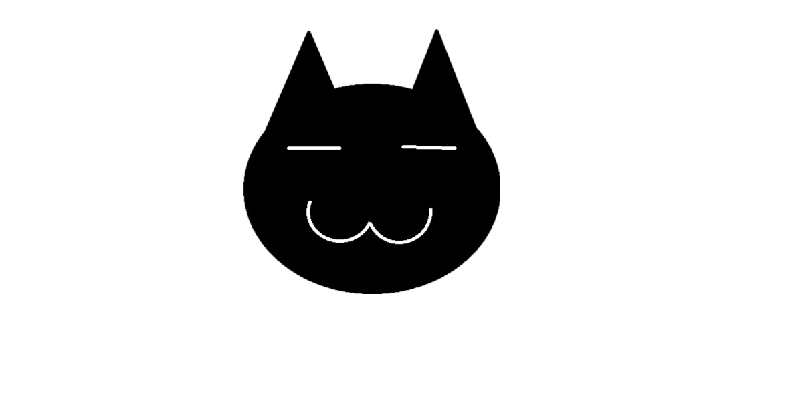

# Nekoo



## Overview
**Nekoo** is a Denial of Service (DoS) application designed to be used across multiple devices. Fully coded in C# with .NET 9, Nekoo offers a flexible and powerful solution for simulating DoS attacks. This tool is intended for educational and testing purposes, allowing users to learn about network vulnerabilities and defense mechanisms against such attacks.

**Note:** Nekoo is currently available **only for Windows**.

## Features
- **Windows Compatibility**: Developed specifically for Windows using .NET 9, ensuring a stable and optimized experience for users on Windows platforms.
- **DoS Attack Simulation**: Simulates Denial of Service attacks to stress test servers and applications.
- **C# & .NET9**: Developed in C# using the latest .NET 9 framework for optimal performance and compatibility.
- **Customizable Parameters**: Users can adjust attack parameters to simulate different types of DoS attacks.

## Installation
To get started with Nekoo, clone the repository and build the project using the following commands in your Windows Command Prompt or PowerShell:

```powershell
git clone https://github.com/Fr0zyyy/Nekoo
cd Nekoo
dotnet build
```
## Tip
**Nekoo** can be used on multiple devices to make DDoS attacks


## Available flags and commands
| Flag |  About                |
| :-------- | :------------------------- |
| `-c` | Gets Website's or Server's respond code |
| `-a` | Performs attack on Website or Server |
| `-h` | Just regular help command |

## How to use
```powershell
Nekoo https://example.com -c
```
**Output**:
If responds, 200 else other code

```powershell
Nekoo https://example.com -a
```
"-a" starts attack as i mentioned before, if the code will be still 200 the application will continue until it does not responds anymore.

Flag -a, -c does attribute itselves besides -h

example usage:

```powershell
Nekoo https://example.com -a -c
```

**Output**:
Response Code: |code| (|GOOD OR BAD|)
Attack started...


